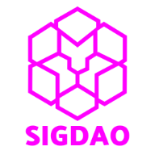

# Sigdao Web3Store

<p align="center">
    
</p>

The __Sigdao Web3Store__ is a platform to register tools and applications for the [Signum](https://signum.network/) eco-system. 
On one hand, this platform serves as a kind of application store, but also as an exhibition center for developers. 

## Digital Asset using Signum Smart Contracts

Each registered entry is represented through a digital (cryptographic) asset/token using [Signum Smart Contracts](./assets/SmartContract.java) and is stored in the 
Signum blockchain. The registrar is the initial owner of that token. Therefore, the token is a so called [Non-Fungible Token](https://en.wikipedia.org/wiki/Non-fungible_token) (NFT):
the token can only be owned by one person at a time, but it's possible to transfer it to another person, e.g. by selling it.

Furthermore, the token can receive amounts from other Signum Accounts. The received amount will be redirected 
(subtracting an inherent contract execution fee) to the owner. The number of transactions (considered as donations) 
is counted, and the received amounts are summed up, and kept in the Smart Contract. This can be used as a success indicator. 

## Developing

Once you've download a project and installed dependencies with `npm install` (or `pnpm install` or `yarn`), start a development server:

```bash
npm run dev

# or start the server and open the app in a new browser tab
npm run dev -- --open
```

## Building

To create a production version of your app:

```bash
npm run build
```

You can preview the production build with `npm run preview`.

> To deploy your app, you may need to install an [adapter](https://kit.svelte.dev/docs/adapters) for your target environment.
